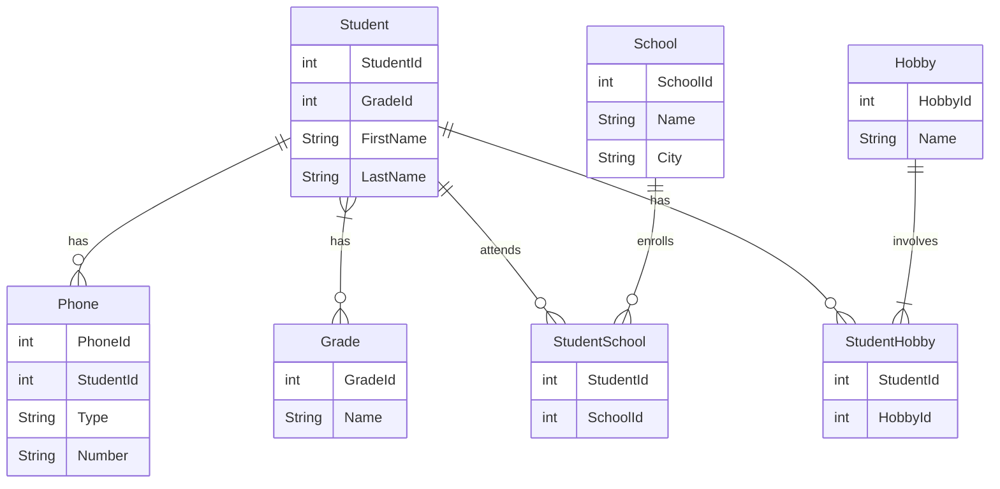

# db2022

```mermaid
erDiagram

    Student ||--o{ Phone : has
    Student }|--o{ Grade : has
    Student ||--o{ StudentSchool : attends
    School ||--o{ StudentSchool : enrolls
    Student ||--o{ StudentHobby : has
    Hobby ||--|{ StudentHobby : involves

    Student{
        int StudentId
        int GradeId
        String FirstName
        String LastName
    }

    School{
        int SchoolId
        String Name
        String City
    }

    Hobby{
        int HobbyId
        String Name
    }

    Phone{
        int PhoneId
        int StudentId
        String Type
        String Number
    }

    Grade{
        int GradeId
        String Name
    }

    StudentSchool{
        int StudentId
        int SchoolId
    }

    StudentHobby{
        int StudentId
        int HobbyId
    }
``` 
